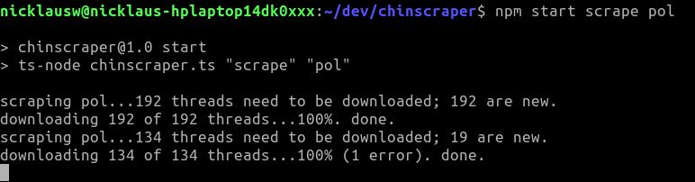

# chinscraper
Downloads threads from 4chan.



## usage
```
npm start [scrape|export] [board name]
```
examples:
```
npm start scrape r9k
```
When run will download threads from r9k into the `logs/r9k` directory. After this, the program waits a minute before repeating.
```
npm start export r9k
```
When run will export the scraped data into `export_r9k.txt`.